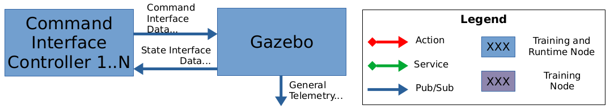
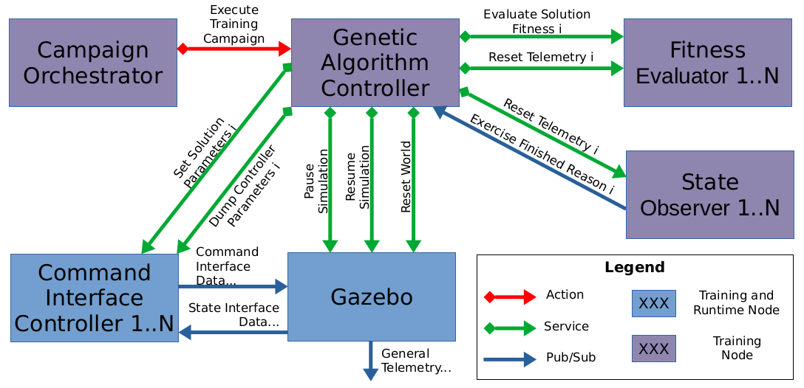
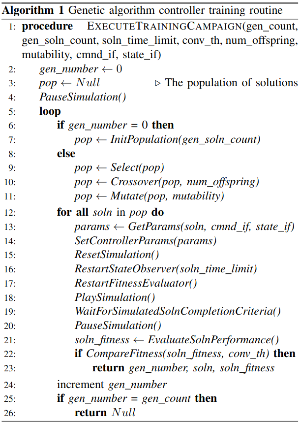

# enpm690_project

## Intro

This project lives at: https://github.com/rnvandemark/enpm690_project

Contains a number of packages to support a genetic algorithm development
platform (which is still a work-in-progress, more on this below). This platform
sits on top of ROS2 galactic and is intended to be able to train any robotic
agent which:
- can be simulated in Gazebo
- can hook into the ROS2 control architecture (i.e. has controllable joints)

It utilizes:
- the generalizability of applying a basic genetic algorithm to a robotic agent
- the plugin offered by the package
  https://github.com/ros-controls/gazebo_ros2_control, which integrates the
  ROS2 control architecture with Gazebo

Together, a configuration of nodes can be used to coordinate the simulation and
evaluation of individual solutions in a population. The general procedure (for
simulating a single solution at a time) is described in the below pseudocode,
while the below image visualizes how this can be accomplished in a ROS2
architecture.

Once training has converged to an acceptable solution, the genes of the
chromosome / parameters can then be loaded into the controller on runtime (also
visualized below).

### Runtime configuration



### Training configuration



### Genetic algorithm controller's main routine

This routine is executed on each goal received for executing training
campaigns (as seen in the 'training configuration' image above):



## Package descriptions

Below are descriptions of the core packages:

### ep_common

These are node interfaces / utilities used in both runtime and training
configurations. Most notably, this includes the command interface controller
interface, which is for sending the outputs of a genetic algorithm's fitness
function to the command interfaces requested in the training campaign.

### ep_common_interfaces

These are basic ROS messages, services, etc used in both runtime and training
configurations.

### ep_training

These are node interfaces / utilities used only in training configurations.
This includes many of the nodes used in the training configuration, such as the
genetic algorithm controller interface (the master node of this configuration),
the state observer interface, the fitness evaluator interface and an extension
of it which depends on time (it subscribes to the system clock for ease of
use), and the campaign orchestrator GUI.

### ep_training_interfaces

These are ROS messages, services, etc used only in training configurations.
This includes the custom action for executing training campaigns.

## Status / TODO's

- There is a critical issue implementing the core of this platform's design,
  which after initial investigation seems to have to do with how the ROS2
  controller manager node and the node which wraps around Gazebo are executed.
  Manipulating the state of the physics simulation (pausing, resuming, and
  resetting) are tricky, but resetting the world and/or simulation somehow
  disconnects the controllers from the simulated telemetry. This makes
  continuous simulation of different solutions/chromosomes impossible at the
  moment, until this is resolved.
- Multiple simulations (of some types, at least) should be able to be executed
  in parallel without interfering with one another. This would require support
  in the genetic algorithm controller and, if the collision bitmask offered in
  older versions of Gazebo is still supported, automated generation of this
  stanza in the robots' URDFs. A nice-to-have would be a visual cue as to which
  is which, such as color-coding of the entire model.

## Example use

### Prerequisites

- Install ROS Galactic desktop and other Gazebo and ROS2 control packages:
```
sudo apt-get install sudo apt-get install ros-galactic-desktop ros-galactic-gazebo-* ros-galactic-control*
```
- Clone this repository and build its packages via Colcon

### Launching a demo

WARNING: this is not yet functional, but this will be along the lines of the final
instructions used to execute learning.

- Launch the training environment to train a one degree of freedom gantry's
  velocity PID controller whose trapezoidal velocity profile has the following
  parameters (substituting '/path/to' appropriately):
```
ros2 launch ep_gantry_velocity_control_demo gantry_velocity_control.launch.py \
    controller_parameters_path:=/path/to/src/enpm690_project/ep_demos/ep_gantry_velocity_control_demo/config/training.yaml \
    initial_joint_position:=3.0 \
    motion_profile_time_accelerating:=0.25 \
    motion_profile_time_constant_velocity:=3.0 \
    motion_profile_acceleration:=4.0
```
- Input the desired hyperparameters into the campaign orchestrator user
  interface, the press 'Start' to start the training campaign.
